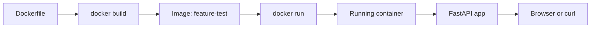

# Docker Guide For Beginners

Docker runs applications inside containers. A container includes the app, runtime, and dependencies needed to run it consistently.

For this project, Docker lets you run the FastAPI app without manually installing `fastapi` and `uvicorn` on your machine.

## Key Ideas

- Image: a package built from a `Dockerfile`.
- Container: a running instance of an image.
- Dockerfile: instructions used to build an image.
- Port mapping: connects a port inside the container to a port on your machine.

## Install Docker

1. Go to https://www.docker.com/products/docker-desktop/
2. Download Docker Desktop for your operating system.
3. Install it using the default options.
4. Open Docker Desktop.
5. Wait until Docker says it is running.

Verify Docker works:

```bash
docker --version
docker run hello-world
```

If `hello-world` runs successfully, Docker is ready.

## Project Dockerfile

This project has a `Dockerfile` with these responsibilities:

- Start from `python:3.12-slim`.
- Use `/app` as the working directory.
- Install `fastapi` and `uvicorn`.
- Copy `main.py` into the image.
- Start the API with Uvicorn on port `8000`.

## Build The Image

Run this command from the project root:

```bash
docker build -t feature-test .
```

What it means:

- `docker build`: create an image.
- `-t feature-test`: name the image `feature-test`.
- `.`: use the current folder as the build context.

## Run The Container

```bash
docker run --rm -p 8000:8000 feature-test
```

What it means:

- `docker run`: start a container.
- `--rm`: delete the container when it stops.
- `-p 8000:8000`: map your machine's port `8000` to the container's port `8000`.
- `feature-test`: the image to run.

Open the app:

- http://localhost:8000/
- http://localhost:8000/data
- http://localhost:8000/docs

Stop the container with `Control + C`.

## Docker Flow Diagram



## Common Commands

List running containers:

```bash
docker ps
```

List all containers:

```bash
docker ps -a
```

List images:

```bash
docker images
```

Stop a container:

```bash
docker stop container_id_or_name
```

Remove an image:

```bash
docker rmi image_id_or_name
```

## Common Problems

If Docker says it cannot connect to the daemon, open Docker Desktop and wait until it is running.

If port `8000` is already in use, stop the other app or run this project on a different host port:

```bash
docker run --rm -p 8001:8000 feature-test
```

Then open:

```text
http://localhost:8001/
```

If the image seems old after code changes, build it again:

```bash
docker build -t feature-test .
```
