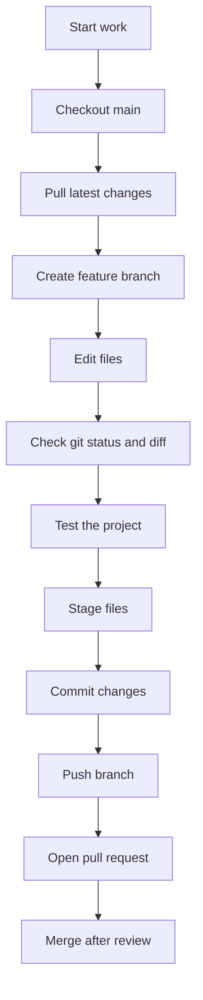

# Git Workflow For Beginners

Git tracks changes in your code. GitHub stores those changes online so the team can collaborate.

## Key Ideas

- Repository: the project folder tracked by Git.
- Branch: an isolated line of work.
- Commit: a saved snapshot of your changes.
- Pull: download the latest changes from GitHub.
- Push: upload your commits to GitHub.
- Pull request: a request to review and merge your branch into `main`.

## One-Time Setup

Install Git and verify it works:

```bash
git --version
```

Configure your name and email:

```bash
git config --global user.name "Your Name"
git config --global user.email "you@example.com"
```

## Normal Daily Flow

Always start by updating `main`:

```bash
git checkout main
git pull --ff-only origin main
```

Create a branch for your change:

```bash
git checkout -b feature/short-description
```

Make your changes, then check what changed:

```bash
git status
git diff
```

Stage the files you want to save:

```bash
git add main.py readme.md
```

Commit the change:

```bash
git commit -m "Add useful short description"
```

Push the branch:

```bash
git push -u origin feature/short-description
```

Open a pull request on GitHub and ask for review.

## Workflow Diagram



## Useful Commands

See current branch and changed files:

```bash
git status
```

See the exact changes:

```bash
git diff
```

See recent commits:

```bash
git log --oneline -10
```

Switch branches:

```bash
git checkout branch-name
```

List branches:

```bash
git branch
```

## Good Habits

- Pull latest `main` before starting work.
- Use one branch per task.
- Keep commits small and focused.
- Write commit messages that explain the result.
- Run the project before pushing.
- Do not commit secrets, passwords, tokens, or private keys.

## If Something Feels Wrong

Stop and check the current state:

```bash
git status
```

If you are unsure, ask before running commands that delete or overwrite work.
