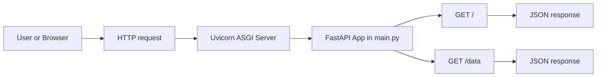
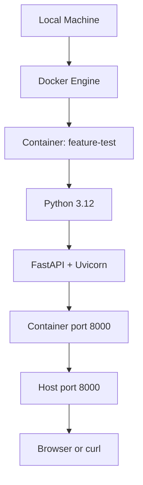
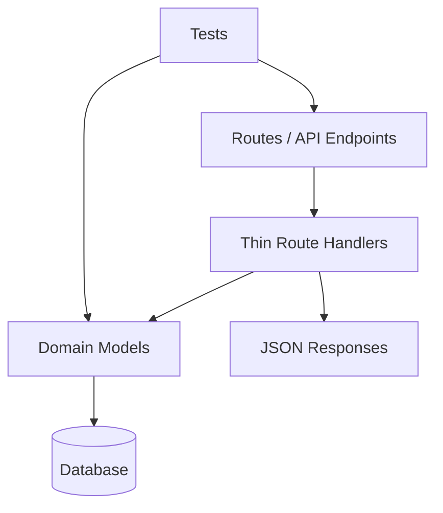
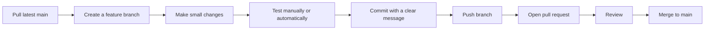

# Feature Test

Small FastAPI test project used to validate basic concepts and first connections before building larger features. It currently exposes a simple API and can run either directly on your machine or inside Docker.

The goal is not to be a complete application yet. The goal is to confirm that the basic pieces work: local setup, Docker setup, HTTP requests, API responses, and the first connection points that future features will use.

This project will keep growing, so the documentation favors clear beginner-friendly workflows and Rails way principles: convention over configuration, small focused files, simple routes first, and a predictable structure as features are added.

## Current Status

- [x] Deploy with Docker
- [x] Create example API
- [ ] Connect with database
- [ ] Create API interaction with database
- [ ] Optional: use an ORM

## Start Here

Follow these steps in order if this is your first time opening the project.

### 1. Confirm You Have Git

Git is required to download the project from GitHub and keep your local copy updated.

```bash
git --version
```

If the command does not work, install Git first:

- macOS: run `xcode-select --install`, or download Git from https://git-scm.com/downloads
- Windows: download Git from https://git-scm.com/downloads
- Linux: install it with your package manager, for example `sudo apt install git`

### 2. Confirm You Can Access GitHub

The code repository is hosted on GitHub:

```text
https://github.com/rway11200-cell/test-1
```

Open that URL in your browser and confirm you can see the repository. If the repository is private, make sure you are logged in with a GitHub account that has access.

### 3. Open VS Code

VS Code is the recommended editor for this project.

If you do not have it installed yet:

1. Go to https://code.visualstudio.com/
2. Download VS Code for your operating system.
3. Install it using the default options.
4. Open VS Code.

Recommended VS Code extensions:

- Python
- Docker
- GitHub Pull Requests

### 4. Open A Terminal

You can use either your system terminal or the terminal inside VS Code.

To open the VS Code terminal:

1. Open VS Code.
2. Go to `Terminal` > `New Terminal`.
3. Run commands from that terminal.

### 5. Clone The Repository

Choose a folder where you keep your projects, then run:

```bash
git clone https://github.com/rway11200-cell/test-1.git
```

Enter the project folder:

```bash
cd test-1
```

Open the project in VS Code:

```bash
code .
```

If `code .` does not work, open VS Code manually, then use `File` > `Open Folder` and select the `test-1` folder.

### 6. Choose How To Run The Project

After the repository is open locally, choose one option:

- Manual setup: install Python libraries on your machine and run Uvicorn.
- Docker setup: build and run the container without installing the Python libraries manually.

Both options are documented below.

## What You Need

To run the project manually:

- Python 3.12 or newer
- `pip`, included with most Python installations
- The Python libraries `fastapi` and `uvicorn`

To run the project with Docker:

- Docker Desktop installed and running
- Basic terminal access

Optional but recommended:

- Git, to clone the project and manage changes
- A code editor such as VS Code

## Install Git

Check if Git is already installed:

```bash
git --version
```

If it is not installed:

- macOS: install Xcode Command Line Tools with `xcode-select --install`, or install Git from https://git-scm.com/downloads
- Windows: install Git from https://git-scm.com/downloads
- Linux: use your package manager, for example `sudo apt install git`

For a beginner Git workflow, see [`docs/git-workflow.md`](docs/git-workflow.md).

## Install Docker

Docker lets you run this project in a container, so you do not need to install Python libraries directly on your machine.

Basic installation:

1. Go to https://www.docker.com/products/docker-desktop/
2. Download Docker Desktop for your operating system.
3. Install it using the default options.
4. Open Docker Desktop and wait until it says Docker is running.
5. Verify the installation:

```bash
docker --version
docker run hello-world
```

For a beginner Docker guide, see [`docs/docker-guide.md`](docs/docker-guide.md).

## Run Manually

Install the libraries by hand:

```bash
pip install fastapi uvicorn
```

Start the API:

```bash
uvicorn main:app --reload --host 0.0.0.0 --port 8000
```

Open these URLs:

- http://localhost:8000/
- http://localhost:8000/data
- http://localhost:8000/docs

Expected root response:

```json
{"message":"Hello World! This is my first cloud container 🚀"}
```

## Run With Docker

Build the image:

```bash
docker build -t feature-test .
```

Run the container:

```bash
docker run --rm -p 8000:8000 feature-test
```

Open these URLs:

- http://localhost:8000/
- http://localhost:8000/data
- http://localhost:8000/docs

Stop the container with `Control + C` in the terminal where it is running.

## Test The Project

There is no automated test suite yet. For now, test the API manually:

```bash
curl http://localhost:8000/
curl http://localhost:8000/data
```

You can also use the interactive API documentation generated by FastAPI:

```text
http://localhost:8000/docs
```

## Architecture

Current architecture:



Docker architecture:



Expected Rails way growth path:



## Team Workflow

Use this simple flow for every change:



Basic commands:

```bash
git checkout main
git pull --ff-only origin main
git checkout -b feature/my-change
# edit files
git status
git add .
git commit -m "Describe the change"
git push -u origin feature/my-change
```

## Project Files

- `main.py`: FastAPI application and current routes.
- `Dockerfile`: Docker image definition for running the API.
- `docs/git-workflow.md`: beginner Git workflow.
- `docs/docker-guide.md`: beginner Docker guide.
